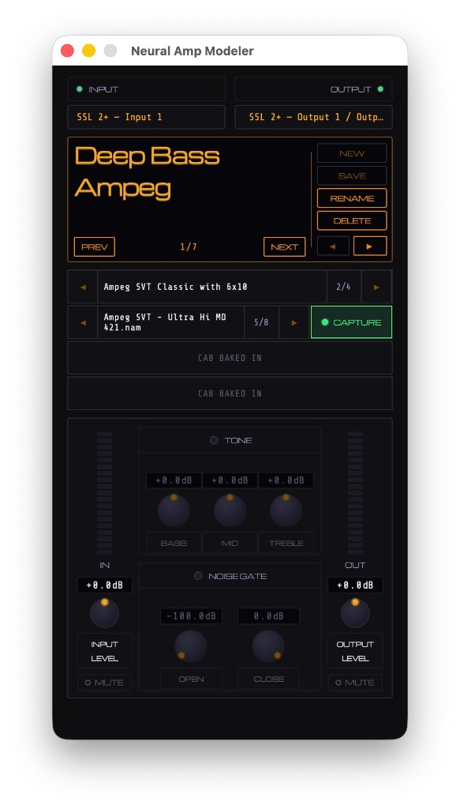

<div align="center">


# Neural Amp Modeler

**Version:** see the [`VERSION`](VERSION) file at the repository root (single source of truth for CMake and releases).

A JUCE-based Neural Amp Modeler implementation, derived from a large rewrite of [Tr3m/nam-juce](https://github.com/Tr3m/nam-juce).

[](LICENSE.txt)

</div>

This project builds on Steven Atkinson’s [NeuralAmpModeler](https://github.com/sdatkinson/NeuralAmpModelerPlugin) ecosystem: run `.nam` captures and cabinet IRs inside AU, VST3, and a standalone app.

---

## What changed in this fork

- **Major UI and architecture rewrite** — mock-driven layout, new `NamUi` stack, streamlined workflow.
- **JUCE 8** — vendored under `Modules/JUCE/` and wired through CMake.
- **Presets redesigned** — JSON preset library under `NAM/Presets/` with `manifest.json`, save/rename/delete/reorder, and paths stored **relative to the NAM root** (no UI-only aliases in files).
- **Single opinionated content layout** — one root folder (your **`NAM`** directory) with fixed subfolders; see below.
- **Tighter, compact plugin window** — optimized for a narrow portrait layout.

---

## NAM directory layout

The app stores a **NAM root** path (via standalone **File → Settings → Set NAM Directory**, or equivalent). All captures, IRs, and presets live under that root.

**Folder names are fixed:** under that root you must use exactly **`Captures`**, **`IRs`**, and **`Presets`** (same spelling and capitalization). Renaming or nesting them differently will not be picked up.

```
NAM/
├── Captures/              # .nam models
│   ├── *.nam              # optional: loose files here show under “Standalone” (first in UI)
│   └── <collection>/      # optional subfolders of .nam files
├── IRs/                   # .wav impulse responses (this fork uses folder name IRs)
│   ├── *.wav              # optional: loose files show under “Standalone” (first in UI)
│   └── <collection>/
└── Presets/               # user preset library
    ├── manifest.json      # ordered list of { "id", "name" }
    └── <id>.json          # one preset file per id (paths relative to NAM root)
```

**Standalone (collection row):** If there are `.nam` or `.wav` files **directly** in `Captures/` or `IRs/`, the browser shows a synthetic **Standalone** entry **first**, then other folders in natural sort order.

---

## UI preview

<p align="center">
  
</p>

---

## Download — macOS standalone (Apple Silicon)

GitHub cannot offer a one-click download of a **`.app`** bundle from the file tree (it is a folder). Use the ZIP instead:

**[Download Neural Amp Modeler (macOS arm64)](https://github.com/wmbutler/nam-juce/raw/master/binaries/macos-arm64/NeuralAmpModeler-macOS-arm64.zip)**

Unpack the archive and open **`Neural Amp Modeler.app`** (you may need **right-click → Open** the first time for Gatekeeper).

The same **`Neural Amp Modeler.app`** also lives under **[`binaries/macos-arm64/`](binaries/macos-arm64/)** in the repo for browsing or cloning. Both the app bundle and the ZIP are refreshed when someone runs a **Release** standalone build on an **arm64-only** macOS CMake configuration (see *Building* below).

---

## Building (macOS — Apple Silicon / arm64)

**Supported and tested here:** macOS **arm64**, **Release** builds via CMake. Other platforms and architectures have **not** been compiled or validated in this fork.

Prerequisites: Xcode command-line tools (or Xcode), CMake ≥ 3.15.

```bash
git clone <your-repo-url> nam-juce
cd nam-juce

# Preferred: build Release standalone and refresh binaries/macos-arm64/
python3 Scripts/build_macos_arm_binary.py

# Equivalent manual CMake commands
cmake -S . -B build-release-arm -DCMAKE_BUILD_TYPE=Release -DCMAKE_OSX_ARCHITECTURES=arm64
cmake --build build-release-arm --config Release --target NEURAL_AMP_MODELER_Standalone
```

On Apple Silicon, this project’s CMake prefers **`CMAKE_OSX_ARCHITECTURES=arm64`** when the host reports ARM hardware.

Artifacts (names may match your generator):

- Standalone: `build-release-arm/NEURAL_AMP_MODELER_artefacts/Release/Standalone/`
- AU / VST3: under `build-release-arm/NEURAL_AMP_MODELER_artefacts/Release/`

**Note:** For manual audio checks on Apple Silicon, prefer **Release** (or your usual ARM Release artefact). Debug standalone behavior may differ for real-time audio.

---

## Optional CMake flags

- **`USE_NATIVE_ARCH=1`** — On x86_64 hosts this can enable extra CPU flags; on macOS **arm64** the project skips the x86-only tuning. Safe to leave off for typical Apple Silicon builds.

---

## Plugin formats

- AU  
- VST3  
- Standalone  

---

## Models and IRs

Community captures and impulse responses are widely shared on sites such as [Tone3000](https://www.tone3000.com/).

---

## Windows / Linux / Intel macOS

There are **no** maintained build or install instructions for Windows or Linux in this README, and **no** Chocolatey or other package-manager claims. If you build on another OS or CPU, expect to adjust toolchain paths and JUCE dependencies yourself; issues on untested platforms are not guaranteed to be reproduced here.

---

## License

See [LICENSE.txt](LICENSE.txt).
